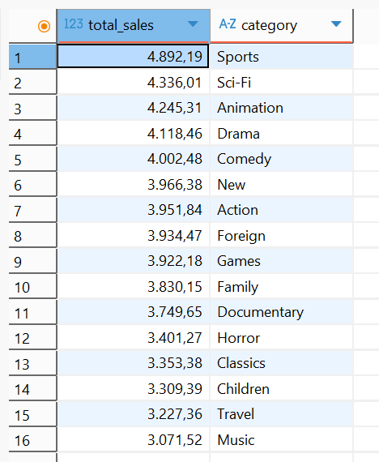
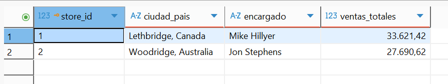
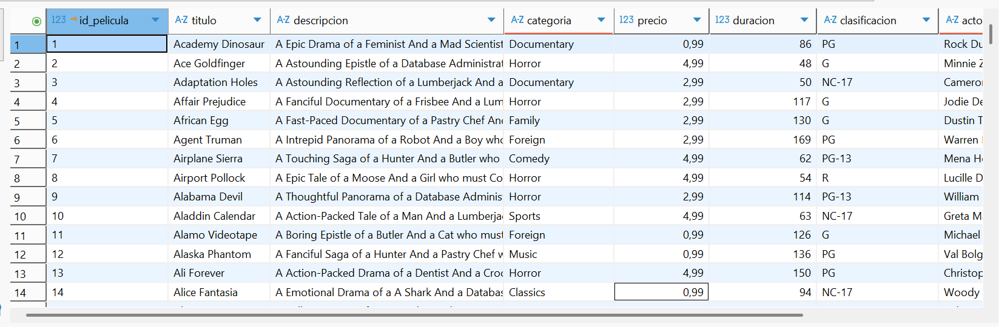
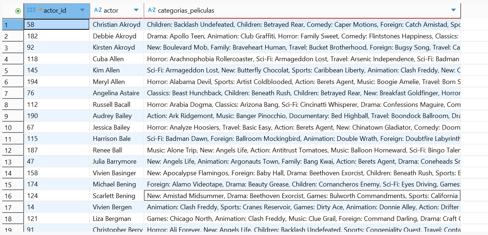
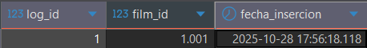
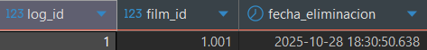

# 📘 Práctica 5: Modelo Relacional. Vistas y disparadores
---

## 🏫 Información Académica

| **Universidad**        | Universidad de La Laguna |
|------------------------|--------------------------|
| **Facultad**           | Escuela Superior de Ingeniería |
| **Asignatura**         | Administración de Bases de Datos |
| **Curso académico**    | 2025 / 2026 |
| **Práctica**           | Nº 5 – Modelo Relacional. Vistas y disparadores |

---

# 📑 **Índice**

- [📘 Práctica 5: Modelo Relacional. Vistas y disparadores](#-práctica-5-modelo-relacional-vistas-y-disparadores)
  - [🏫 Información Académica](#-información-académica)
  - [👥 Miembros del Grupo](#-miembros-del-grupo)
  - [1. Restauración de la base de datos](#1-restauración-de-la-base-de-datos)
  - [2. Identifique las tablas, vistas y secuencias](#2-identifique-las-tablas-vistas-y-secuencias)
  - [3. Identifique las tablas principales y sus principales elementos](#3--identifique-las-tablas-principales-y-sus-principales-elementos)
  - [4. Realice las siguientes consultas](#4-realice-las-siguientes-consultas)
    - [a. Ventas totales por categoría](#a-obtenga-las-ventas-totales-por-categoría-de-películas-ordenadas-descendentemente)
    - [b. Ventas totales por tienda](#b-obtenga-las-ventas-totales-por-tienda-donde-se-refleje-la-ciudad-el-país)
    - [c. Lista de películas con actores](#c-obtenga-una-lista-de-películas-donde-se-reflejen-el-identificador-el-título)
    - [d. Información de actores por categorías y películas](#d-obtenga-la-información-de-los-actores-donde-se-incluya-sus-nombres)
  - [5. Realice todas las vistas de las consultas anteriores](#5-realice-todas-las-vistas-de-las-consultas-anteriores-colóqueles-el-prefijo-view_-a-su-denominación)
  - [6. Análisis del modelo y restricciones CHECK](#6-haga-un-análisis-del-modelo-e-incluya-las-restricciones-check-que-considere-necesarias)
  - [7. Explicación de la sentencia en la tabla customer](#7-explique-la-sentencia-que-aparece-en-la-tabla-customer)
  - [8. Trigger para inserción en film](#8-construya-un-disparador-que-guarde-en-una-nueva-tabla-creada-por-usted-la-fecha-de-cuando-se-insertó-un-nuevo-registro-en-la-tabla-film-y-el-identificador-del-film)
  - [9. Trigger para eliminación en film](#9-construya-un-disparador-que-guarde-en-una-nueva-tabla-creada-por-usted-la-fecha-de-cuando-se-eliminó-un-registro-en-la-tabla-film-y-el-identificador-del-film)
  - [10. Significado y relevancia de las secuencias](#10-comente-el-significado-y-la-relevancia-de-las-secuencias)

---

## 👥 Miembros del Grupo

| **Nombre**                 | **Correo**                    |
|---------------------------|-------------------------------|
| Alba Pérez Rodríguez      | alu0101513768@ull.edu.es      |
| Eric Bermúdez Hernández   | alu0101517476@ull.edu.es      |

---

# 1. Restauración de la base de datos

Mediante comandos de plsql realizados en la sesión de prácticas, restauramos la base de datos. En la siguiente imagen se puede apreciar como a raíz de la restauración aparece en la interfaz de dbeaver. El comando utilizado en la sesión de prácticas es el siguiente: 

```bash
pg_restore -U nombre_usuario -d nombre_basedatos -1 ruta_al_archivo.backup
```

.png)

# 2. Identifique las tablas, vistas y secuencias.

En la siguiente imagen se pueden apreciar tanto las tablas, como las visgtas y las secuencias gracias a la interfaz gráfica del dbeaver. En la base de datos existen tanto tablas como secuencias pero no vistas


# 3.  Identifique las tablas principales y sus principales elementos.

A continuación se describen las tablas con sus principales elementos:

**category(category_id: int, name: varchar(25))**

	PK: category_id

**film_category(category_id: int, film_id: int)**

	FK: category_id
	FK: film_id

**language(language_id: int, name: varchar(20))**

	PK: language_id

**film(language_id: int, film_id: int, description: text, fulltext: vector, length: int, rating: function, release_year: year, rental_duration: int, rental_rate: numeric(4, 2), replacement_cost: numeric(5, 2), special_features: text[], title: varchar(255))**

	PK: film_id
	FK: languaje_id

**film_actor(actor_id: int, film_id: int)**

	PK: actor_id
	PK: film_id

**actor(actor_id: int, first_name: varchar(45), last_name: varchar(45))**

	PK: actor_id

**inventory(film_id: int, store_id: int, inventory_id: int)**

	PK: inventory_id
	FK: film_id

**rental(customer_id: int, inventory_id: int, staff_id: int, rental_id: int, rental_date: timestamp, return_date: timestamp)**

	PK: rental_id
	FK: staff_id
	FK: inventory_id
	FK: customer_id

**payment(customer_id: int, rental_id: int, staff_id: int, payment_id: int, amount: numeric, payment_date: timestamp)**

	PK: payment_id
	FK: staff_id
	FK: rental_id
	FK: customer_id

**customer(address_id: int, store_id: int, customer_id: int, active: int, activebool: bool, create_date: timestamp, email: varchar(50), first_name: varchar(45), last_name: varchar(45))**

	PK: customer_id
	FK: address_id

**staff(address_id: int, store_id: int, staff_id: int, active: bool, email: varchar(50), first_name: varchar(45), last_name: varchar(45), password: varchar(40), picture: bytes, username: varchar(16))**

	PK: staff_id
	FK: address_id

**store(address_id: int, manager_staff_id: int, store_id: int)**

	PK: store_id
	FK: manager_staff_id
	FK: address_id

**address(city_id: int, address_id: int, address: varchar(50), address2: varchar(50), district: varchar(20), phone: varchar(20), postal_code: varchar(10))**

	PK: address_id
	FK: city_id

**city(city_id: int, country_id: int, city: varchar(50))**

	PK: city_id
	FK: country_id

**country(country_id: int, country: varchar(50))**

	PK: country_id

# 4. Realice las siguientes consultas.

- **a. Obtenga las ventas totales por categoría de películas ordenadas
descendentemente**

  ```SQL
  SELECT
    SUM(payment.amount) AS total_sales,
    category.name AS category
  FROM payment
  INNER JOIN rental
      ON rental.rental_id = payment.rental_id
  INNER JOIN inventory
      ON inventory.inventory_id = rental.inventory_id
  INNER JOIN film
      ON film.film_id = inventory.film_id
  INNER JOIN film_category
      ON film_category.film_id = film.film_id
  INNER JOIN category
      ON category.category_id = film_category.category_id
  GROUP BY category
  ORDER BY total_sales DESC;

  ```

  La consulta suma todos los pagos realizados por los clientes (payment.amount), los relaciona con qué película se alquiló y a qué categoría pertenece esa película, y luego agrupa esas sumas por categoría de película. Finalmente, ordena los resultados de mayor a menor para mostrar qué categorías han generado más ingresos.



- **b. Obtenga las ventas totales por tienda, donde se refleje la ciudad, el país
(concatenar la ciudad y el país empleando como separador la “,”), y el
encargado. Pudiera emplear *GROUP BY*, *ORDER BY***

```sql
SELECT 
    s.store_id,
    (c.city || ', ' || a.country) AS ciudad_pais,
    CONCAT(st.first_name, ' ', st.last_name) AS encargado,
    SUM(p.amount) AS ventas_totales
FROM store s
    INNER JOIN staff st ON s.manager_staff_id = st.staff_id
    INNER JOIN address ad ON s.address_id = ad.address_id
    INNER JOIN city c ON ad.city_id = c.city_id
    INNER JOIN country a ON c.country_id = a.country_id
    INNER JOIN customer cu ON s.store_id = cu.store_id
    INNER JOIN payment p ON cu.customer_id = p.customer_id
GROUP BY s.store_id, c.city, a.country, st.first_name, st.last_name
ORDER BY ventas_totales DESC;
```
Esta consulta obtiene las ventas totales por cada tienda, mostrando:
- El identificador de la tienda (`store_id`).
- La ciudad y el país concatenados en una sola columna (`ciudad_pais`), utilizando el operador `||` para unir texto.
- El nombre completo del encargado (`encargado`), concatenando el nombre y apellido del empleado.
- El total de ventas (`ventas_totales`), calculado con `SUM(p.amount)`.

Las tablas `store`, `staff`, `address`, `city`, `country`, `customer` y `payment` se relacionan mediante `INNER JOIN` para obtener toda la información necesaria.  
Se utiliza `GROUP BY` para agrupar las ventas por tienda y evitar duplicados.  
Finalmente, `ORDER BY ventas_totales DESC` ordena los resultados de mayor a menor total de ventas.



- **c. Obtenga una lista de películas, donde se reflejen el identificador, el título, descripción, categoría, el precio, la duración de la película, clasificación, nombre y apellidos de los actores (puede realizar una concatenación de ambos). Pudiera emplear GROUP BY**

	```sql
	SELECT 
    f.film_id AS id_pelicula,
    f.title AS titulo,
    f.description AS descripcion,
    c.name AS categoria,
    f.rental_rate AS precio,
    f.length AS duracion,
    f.rating AS clasificacion,
    STRING_AGG(a.first_name || ' ' || a.last_name, ', ') AS actores
	FROM film f
	INNER JOIN film_category fc ON f.film_id = fc.film_id
	INNER JOIN category c ON fc.category_id = c.category_id
	INNER JOIN film_actor fa ON f.film_id = fa.film_id
	INNER JOIN actor a ON fa.actor_id = a.actor_id
	GROUP BY f.film_id, f.title, f.description, c.name, f.rental_rate, f.length, f.rating
	ORDER BY f.title;
	```

Esta consulta lista todas las películas, mostrando:
- El identificador, título, descripción, categoría, precio de alquiler, duración y clasificación de cada película.
- Los actores que participan en cada una, concatenados en una sola columna usando `STRING_AGG`.

Las tablas `film`, `film_category`, `category`, `film_actor` y `actor` se combinan con `INNER JOIN` para unir la información de películas, categorías y actores.  
`STRING_AGG(a.first_name || ' ' || a.last_name, ', ')` concatena los nombres y apellidos de los actores separados por comas.  
Se emplea `GROUP BY` para agrupar la información por película y evitar repeticiones, y `ORDER BY f.title` para ordenar las películas alfabéticamente.




- **d. Obtenga la información de los actores, donde se incluya sus nombres y apellidos, las categorías y sus películas. Los actores deben de estar agrupados y, las categorías y las películas deben estar concatenados por “:”**

```sql
	SELECT 
    a.actor_id,
    a.first_name || ' ' || a.last_name AS actor,
    STRING_AGG(c.name || ': ' || f.title, ', ') AS categorias_peliculas
	FROM actor a
	INNER JOIN film_actor fa ON a.actor_id = fa.actor_id
	INNER JOIN film f ON fa.film_id = f.film_id
	INNER JOIN film_category fc ON f.film_id = fc.film_id
	INNER JOIN category c ON fc.category_id = c.category_id
	GROUP BY a.actor_id, a.first_name, a.last_name
	ORDER BY a.last_name, a.first_name;
```
Esta consulta obtiene información de cada actor, incluyendo:
- Su id, nombre y apellido concatenados.
- Las categorías y títulos de películas en las que participa, concatenados con “:” dentro de una misma cadena.

`STRING_AGG(c.name || ': ' || f.title, ', ')` une la categoría y el título de cada película en un formato legible, separando cada par con comas.  
Las tablas `actor`, `film_actor`, `film`, `film_category` y `category` se combinan para obtener la relación entre actores, películas y categorías.  
El `GROUP BY` agrupa los resultados por actor, y `ORDER BY a.last_name, a.first_name` ordena los nombres alfabéticamente.




# 5. Realice todas las vistas de las consultas anteriores. Colóqueles el prefijo view_ a su denominación.

- Ejercicio a:
Creamos la vista:

```sql
Create view view_ventas_totales as SELECT SUM(p.amount) as ventas_totales,
	c.name as categoría
FROM payment p 
INNER JOIN rental as r
ON r.rental_id = p.rental_id
INNER JOIN inventory i
on i.inventory_id = r.inventory_id
INNER JOIN film_category fc
ON fc.film_id = i.film_id
INNER JOIN category c
ON c.category_id = fc.category_id
GROUP BY c.name 
ORDER BY ventas_totales DESC; 
```
Comprobamos su funcionamiento:
```sql
SELECT * FROM view_ventas_totales;
```


- Ejercicio b:
Creamos vista:

```sql
CREATE OR REPLACE VIEW vista_b_ventas_tienda AS
SELECT 
    s.store_id,
    (c.city || ', ' || a.country) AS ciudad_pais,
    st.first_name || ' ' || st.last_name AS encargado,
    SUM(p.amount) AS ventas_totales
FROM store s
INNER JOIN staff st ON s.manager_staff_id = st.staff_id
INNER JOIN address ad ON s.address_id = ad.address_id
INNER JOIN city c ON ad.city_id = c.city_id
INNER JOIN country a ON c.country_id = a.country_id
INNER JOIN customer cu ON s.store_id = cu.store_id
INNER JOIN payment p ON cu.customer_id = p.customer_id
GROUP BY s.store_id, c.city, a.country, st.first_name, st.last_name
ORDER BY ventas_totales DESC;
```
Comprobamos su funcinamiento:
```sql
SELECT * FROM vista_b_ventas_tienda;
```


- Ejercicio c:
Creamos vista:
```sql
CREATE OR REPLACE VIEW vista_c_peliculas_actores AS
SELECT 
    f.film_id AS id_pelicula,
    f.title AS titulo,
    f.description AS descripcion,
    c.name AS categoria,
    f.rental_rate AS precio,
    f.length AS duracion,
    f.rating AS clasificacion,
    STRING_AGG(a.first_name || ' ' || a.last_name, ', ') AS actores
FROM film f
INNER JOIN film_category fc ON f.film_id = fc.film_id
INNER JOIN category c ON fc.category_id = c.category_id
INNER JOIN film_actor fa ON f.film_id = fa.film_id
INNER JOIN actor a ON fa.actor_id = a.actor_id
GROUP BY f.film_id, f.title, f.description, c.name, f.rental_rate, f.length, f.rating
ORDER BY f.title;
```
Comprobamos funcionamiento:
```sql
SELECT * FROM vista_c_peliculas_actores;
```


- Ejercicio d:
Creamos vista:
```sql
CREATE OR REPLACE VIEW vista_d_actores_categorias_peliculas AS
SELECT 
    a.actor_id,
    a.first_name || ' ' || a.last_name AS actor,
    STRING_AGG(c.name || ': ' || f.title, ', ') AS categorias_peliculas
FROM actor a
INNER JOIN film_actor fa ON a.actor_id = fa.actor_id
INNER JOIN film f ON fa.film_id = f.film_id
INNER JOIN film_category fc ON f.film_id = fc.film_id
INNER JOIN category c ON fc.category_id = c.category_id
GROUP BY a.actor_id, a.first_name, a.last_name
ORDER BY a.last_name, a.first_name;

```
Comprobamos funcionamiento:
```sql
SELECT * FROM vista_d_actores_categorias_peliculas;
```


# 6. Haga un análisis del modelo e incluya las restricciones CHECK que considere necesarias.

Analizando el modelo de la base de datos con la que hemos experimentado en esta práctica, vamos a proceder a hacer restricciones CHECK

1. Tabla `film`

```SQL
ALTER TABLE film
  ADD CONSTRAINT chk_film_release_year
    CHECK (release_year BETWEEN 1900 AND EXTRACT(YEAR FROM CURRENT_DATE) + 5),
  ADD CONSTRAINT chk_film_length
    CHECK (length IS NOT NULL AND length >= 0),
  ADD CONSTRAINT chk_film_rental_duration
    CHECK (rental_duration > 0),
  ADD CONSTRAINT chk_film_rental_rate
    CHECK (rental_rate >= 0),
  ADD CONSTRAINT chk_film_replacement_cost
    CHECK (replacement_cost >= 0),
  ADD CONSTRAINT chk_film_costs_relation
    CHECK (replacement_cost >= rental_rate),
  ADD CONSTRAINT chk_film_title
    CHECK (title IS NOT NULL),
  ADD CONSTRAINT chk_film_rating_enum

```

- `CHECK (release_year BETWEEN 1900 AND year_actual + 5)`

Obliga a que el año de estreno tenga una fecha razonable, además de que permite los títulos que llegan próximamente en un plazo de 5 años

- `CHECK (length IS NOT NULL AND length >= 0)`

Hace que la duración no puede ser negativa y no vacía

- `CHECK (rental_rate >= 0)`

Hace que el precio del alquiler no pueda ser negativo

- `CHECK (replacement_cost >= rental_rate)`

Hace que reponer una película sea igual o más caro que un alquiler, ya que es raro que reponer cueste menos que un alquiler

- `CHECK (title IS NOT NULL)`

Fuerza a que un título no esté vacío

2. Tabla `languaje`

```SQL
ALTER TABLE language
  ADD CONSTRAINT chk_language_name
    CHECK (btrim(name) <> '');

```

Esta restricción hace que el nombre desea no vacío

3. Tabla `category`

```SQL
ALTER TABLE category
  ADD CONSTRAINT chk_category_name
    CHECK (btrim(name) <> '');

```

Esta restricción evita categorías sin nombre

4. Tabla `actor`

```SQL
ALTER TABLE actor
  ADD CONSTRAINT chk_actor_first_name
    CHECK (btrim(first_name) <> ''),
  ADD CONSTRAINT chk_actor_last_name
    CHECK (btrim(last_name) <> '');

```

Hace que no hayan ni nombres ni apellidos de los actores vacíos

5. Tabla `rental`

```SQL
ALTER TABLE rental
  ADD CONSTRAINT chk_rental_dates
    CHECK (return_date IS NULL OR return_date >= rental_date);

```

Esta restricción hace que la devolución deba ser el mismo día o después. En caso de que no se haya devuelto, tendrá valor NULL

6. Tabla `payment`

```SQL
ALTER TABLE payment
  ADD CONSTRAINT chk_payment_amount
    CHECK (amount >= 0);

```

Hace que un pago no pueda ser negativo

7. Tabla `customer`

```SQL
ALTER TABLE customer
  ADD CONSTRAINT chk_customer_first_name
    CHECK (btrim(first_name) <> ''),
  ADD CONSTRAINT chk_customer_last_name
    CHECK (btrim(last_name) <> ''),
  ADD CONSTRAINT chk_customer_active_bit
    CHECK (active IN (0, 1)),
  ADD CONSTRAINT chk_customer_active_sync
    CHECK (
      (activebool = TRUE  AND active = 1) OR
      (activebool = FALSE AND active = 0)
    );

```

- `CHECK (btrim(first_name) <> '' AND btrim(last_name) <> '')`

Esta restricción evita que hayan clientes sin nombre

- `CHECK (active IN (0,1))`

Hace que si el atributo `active` es un entero que representa activo/inactivo, fuerza los valores booleanos de 0 o 1

- `CHECK ((activebool = TRUE AND active = 1) OR (activebool = FALSE AND active = 0))`

Sincroniza el campo booleano `activebool` con el entero `active`, de esta manera evitamos contradicciones entre los dos atributos

8. Tabla `staff`

```SQL
ALTER TABLE staff
  ADD CONSTRAINT chk_staff_first_name
    CHECK (btrim(first_name) <> ''),
  ADD CONSTRAINT chk_staff_last_name
    CHECK (btrim(last_name) <> ''),
  ADD CONSTRAINT chk_staff_email_format
    CHECK (email ~ '^[^@]+@[^@]+\\.[^@]+$');

```

- `CHECK (btrim(first_name) <> '' AND btrim(last_name) <> '')`

Esta restricción evita que hayan empleados sin nombre

- `CHECK (email ~ '^[^@]+@[^@]+\.[^@]+$')`

Valida que haya un formato para escribir los emails

9. Tabla `address`

```SQL
ALTER TABLE address
  ADD CONSTRAINT chk_address_main
    CHECK (btrim(address) <> ''),
  ADD CONSTRAINT chk_address_phone_blank
    CHECK (phone IS NULL OR btrim(phone) <> '');

```

- `CHECK (btrim(address) <> '')`

Esta restricción no permite direcciones vacías

- `CHECK (phone IS NULL OR btrim(phone) <> '')`

Permite que un teléfono sea NULL y que si hay un teléfono que tenga dígitos

10. Tabla `city`

```SQL
ALTER TABLE city
  ADD CONSTRAINT chk_city_name
    CHECK (btrim(city) <> '');

```

Esta restricción hace que no hayan ciudades sin nombre

11. Tabla `country`

```SQL
ALTER TABLE country
  ADD CONSTRAINT chk_country_name
    CHECK (btrim(country) <> '');

```

Esta restricción evita países sin nombre


# 7. Explique la sentencia que aparece en la tabla customer 

```SQL
last_updated BEFORE UPDATE ON customer
FOR EACH ROW EXECUTE PROCEDURE last_updated()
```

A continuación vamos a ir desglosando el trigger por pasos para explicarlo correctamente.

1. Nombre del trigger

El nombre que se le da al trigger es `last_updated`

2. Momento de ejecución

Este trigger se ejecutará antes de que la fila sea actualizada en la tabla `customer`, esto es debido al `BEFORE UPDATE`

3. En qué tabla actúa

Solamente se activa cuando se modifica un registro de la tabla `customer`, esto es debido a `ON CUSTOMER`

4. Frecuencia

El trigger se ejecuta una vez por cada fila modificada, no solo una vez por sentencia. Es decir, si se actualizan 10 clientes con una sola sentencia, el trigger se ejecutará 10 veces. Esto es debido a `FOR EACH ROW`

5. Que hace el trigger

`EXECUTE PROCEDURE last_updated()` llama a una función llamada `last_updated()`, que lo que hace es actualizar automáticamente una columna de fecha, como `last_update`, poniendo la fecha y hora actual del sistema.

**Identifique alguna tabla donde se utilice una solución similar**
  
La tabla que utiliza una solución similar es la tabla actor, ya que la base de datos tiene creado en esta tabla el siguiente trigger:

```SQL
last_updated BEFORE UPDATE ON
public.actor 
FOR EACH ROW EXECUTE FUNCTION last_updated()
```

Como se puede apreciar, la función y finalidad son idénticas pero está aplicado a otra tabla

# 8. Construya un disparador que guarde en una nueva tabla creada por usted la fecha de cuando se insertó un nuevo registro en la tabla film y el identificador del film. 

Primero debemos crear la tabla, para ello, hemos ejecutado el siguiente código SQL:

```SQL
CREATE TABLE film_log (
    log_id SERIAL PRIMARY KEY,        -- Identificador único del registro en esta tabla
    film_id INT NOT NULL,             -- Identificador de la película insertada
    fecha_insercion TIMESTAMP NOT NULL  -- Fecha y hora exacta de inserción
);

```

Esta tabla llamada `film_log` almacenará el historial

Después, creamos la función que ejecutará el trigger: 

```SQL
CREATE OR REPLACE FUNCTION film_report()
RETURNS TRIGGER AS $$
BEGIN
    INSERT INTO film_log(film_id, fecha_insercion)
    VALUES (NEW.film_id, NOW());  -- NEW hace referencia al nuevo registro insertado en film
    RETURN NEW;
END;
$$ LANGUAGE plpgsql;

```

Esta función se ejecuta automáticamente cuando se inserta una película nueva, usa `NEW.film_id` para capturar el ID de la película recién insertada, `NOW()` obtiene la fecha y hora actual y finalmente inserta esos datos en la tabla `film_log`

Por último, creamos el trigger que llama a la función

```SQL
CREATE TRIGGER trigger_registrar_insercion_film
AFTER INSERT ON film
FOR EACH ROW
EXECUTE FUNCTION registrar_insercion_film();

```

Este trigger es de tipo `AFTER INSERT`, es decir, se dispara después de que ha insertado el registro en `film`, actuando por cada fila insertada ejecutando la función que acabamos de crear

Para comprobar que funcionaba correctamente el trigger, hemos introducido la siguiente fila en la tabla `film`:

```SQL
INSERT INTO film (film_id, title, language_id, rental_duration, rental_rate, replacement_cost)
VALUES (1001, 'Matrix Reloaded', 1, 5, 2.99, 15.00);
```

Insertándose automáticamente lo siguiente en la tabla `film log` como se puede apreciar en la siguiente imagen: 




# 9. Construya un disparador que guarde en una nueva tabla creada por usted la fecha de cuando se eliminó un registro en la tabla film y el identificador del film. 

Para realizar este ejercicio, primero creamos una tabla que guarde las eliminaciones de la tabla `film`. Esto lo hacemos de la siguiente forma:

```SQL
CREATE TABLE film_delete_log (
    log_id SERIAL PRIMARY KEY,          -- Identificador único del registro en este log
    film_id INT NOT NULL,               -- Identificador de la película eliminada
    fecha_eliminacion TIMESTAMP NOT NULL -- Fecha y hora de la eliminación
);

```

Después creamos la siguiente función que ejecutará el trigger:

```SQL
CREATE OR REPLACE FUNCTION registrar_eliminacion_film()
RETURNS TRIGGER AS $$
BEGIN
    INSERT INTO film_delete_log(film_id, fecha_eliminacion)
    VALUES (OLD.film_id, NOW()); -- OLD hace referencia al registro que está siendo eliminado
    RETURN OLD;
END;
$$ LANGUAGE plpgsql;

```

Destacar que OLD.film_id contiene el id de la fila que está a punto de eliminarse.

Por último, creamos el trigger que se ejecutará al eliminar cualquier fila de la tabla `film`

```SQL
CREATE TRIGGER trigger_registrar_eliminacion_film
AFTER DELETE ON film
FOR EACH ROW
EXECUTE FUNCTION registrar_eliminacion_film();

```

Para probar el funcionamiento del trigger, borramos una fila de `film` para ver el resultado en nuestra nueva tabla. En este caso, eliminamos la siguiente fila: 

```SQL
DELETE FROM film WHERE film_id = 1001;

```

Al borrar la fila la tabla `film_delete_log` contiene la siguiente fila:



# 10. Comente el significado y la relevancia de las secuencias.

## ✨ Significado y relevancia de las secuencias en la base de datos

Las **secuencias** son objetos especiales dentro del sistema de gestión de bases de datos que se utilizan para generar valores numéricos únicos de forma automática, generalmente de manera incremental. En el modelo de datos del videoclub, cada secuencia está asociada a un campo que actúa como clave primaria, facilitando así la identificación única de cada registro.

A continuación, se describen las secuencias presentes en la base de datos y su función específica:

1. `actor_actor_id_seq`
Genera valores únicos para la columna `actor_id` de la tabla `actor`. Garantiza que cada actor tenga un identificador distinto, necesario para establecer relaciones con otras tablas como `film_actor`.

2. `address_address_id_seq`
Asocia identificadores únicos a cada dirección almacenada en la tabla `address`. Es fundamental para relacionar direcciones con clientes, empleados y tiendas.

3. `category_category_id_seq`
Genera automáticamente el identificador `category_id` de la tabla `category`. Permite clasificar correctamente las películas dentro del catálogo en categorías únicas como “Acción”, “Comedia” o “Drama”.

4. `city_city_id_seq`
Proporciona identificadores únicos para cada ciudad en la tabla `city`, evitando duplicidades y asegurando una estructura organizada para el sistema de localización.

5. `country_country_id_seq`
Genera valores únicos para `country_id` en la tabla `country`, facilitando la organización jerárquica de localizaciones (país → ciudad → dirección).

6. `customer_customer_id_seq`
Produce identificadores irrepetibles para los clientes en la tabla `customer`. Es esencial para gestionar alquileres, pagos y el estado activo o inactivo de cada cliente.

7. `film_film_id_seq`
Genera IDs únicos para la tabla `film`. Esto permite registrar cada película de forma individual y controlada, facilitando su relación con inventarios, alquileres y categorías.

8. `inventory_inventory_id_seq`
Crea valores únicos en `inventory_id` de la tabla `inventory`. Esto permite identificar cada copia física de una película, incluso si existen varias copias del mismo film en diferentes tiendas.

9. `language_language_id_seq`
Genera identificadores únicos para cada idioma disponible en la tabla `language`, lo cual permite establecer el idioma principal de cada película.

10. `payment_payment_id_seq`
Genera automáticamente el `payment_id` para cada pago registrado en la tabla `payment`. Es clave para la trazabilidad financiera y para vincular pagos con alquileres y clientes.

11. `rental_rental_id_seq`
Proporciona identificadores únicos para los registros de alquiler en la tabla `rental`. Permite conocer qué cliente alquiló qué película y en qué momento.

12. `staff_staff_id_seq`
Genera identificadores únicos en la tabla `staff`, asignando un número distinto a cada empleado del videoclub para su correcta identificación dentro del sistema.

13. `store_store_id_seq`
Genera valores únicos para `store_id` en la tabla `store`, permitiendo diferenciar cada tienda física dentro de la base de datos.

Por tanto, sabemos que las secuencias son elementos fundamentales para garantizar la **integridad, coherencia y automatización** del modelo de datos. Gracias a ellas:

- Se generan **claves primarias de forma automática y sin duplicados**.
- Se evita la intervención manual del usuario al asignar identificadores.
- Se mantiene la **integridad referencial** entre tablas relacionadas.
- Se permite la **inserción de datos de forma concurrente y segura**.
- Se asegura un modelo de base de datos escalable, ordenado y consistente.